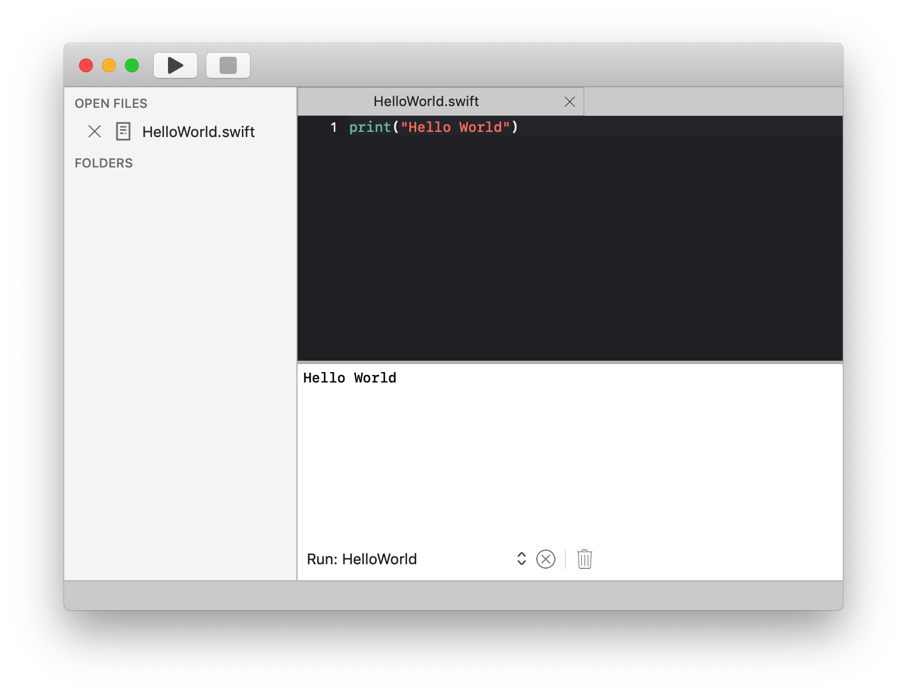

## Introduction	

Nimble is designed as a macOS native, powerful, open source IDE written in Swift. Although Nimble is multi language capable, our inital focus is on Swift.

### How it works
Nimble is written in Swift, taking advantage of all Apple related technology and Apple user experience guidelines. It supports Swift development out of the box, and can be extended by installing plugins or contributing the Nimble core framework.

### Features
* Native, high performance IDE
* Eye pleasing UI following Apple UX guidelines
* Customizable through VSCode theme support and Textmate grammar support
* Very fast Swift auto completion through custom code and SourceKit support
* Project folder support for easily organizing projects in different projects

### Why develop yet another IDE ...
Our primary goal is to provide macOS users with a. NATIVE and b. EXTENDABLE IDE. That's why we decided to develop Nimble. There are other products on the market, but they didn't satisfy our needs.

#### VSCode
Is an awesome product. It is based on web technology that unnecessarily constraints the creation of such a product and the VSCode team had to undertake tremendous efforts and go to great length to achieve features that are more easily and quickly done using native macOS technologies. 

We wanted a fast and light product. Nimble uses less then 80MB upon start and launches in less than 3 seconds. 

#### XCODE
XCode. We love it, it is a great product, but not extendable enough for our purpose.

#### CodeRunner
CodeRunner. It's great for quick quick tasks and running code snippets in different languages. But we needed advanced Swift support and it was not extendable enough for our purposes 


## Installing Nimble

### Requirements

Nimble requires

* macOS 10.14 or higher
* Swift compiler 5.1 or higher

### Install

Nimble is availabe through the Apple App Store following this link

## Hello World
1. Start Nimble
2. Press Command(⌘) + N to create a new file
3. Press Command(⌘) + S to save the file as 'HelloWorld.**swift**'
4. Type 
 ``` swift
 	print("Hello World")
 ```

5. Press Command(⌘) + R to build and run the file


